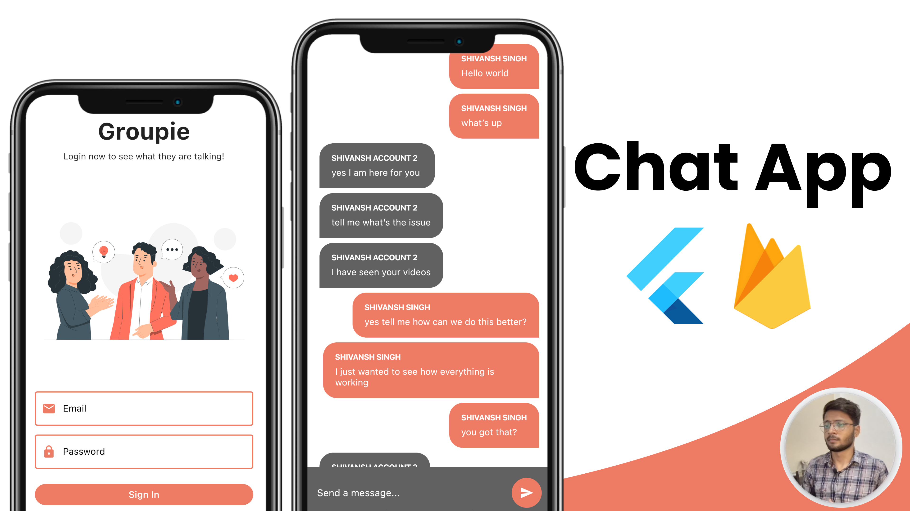

# group_chatapp
Group based chat app in Flutter and Firebase with Cloudfirestore, Firebase Auth and StreamBuilders 🔥

# Overview
Welcome to the master class of Flutter and Firebase in which we will create a chat app from scratch. Today you're going to learn the best practices when it comes to enabling firebase for your flutter project.

 ## SETTING IT UP
 1. Add firbease to this project and do check the google-services.json and GoogleServices-Info.plist file
 2. Now run the app 
 

